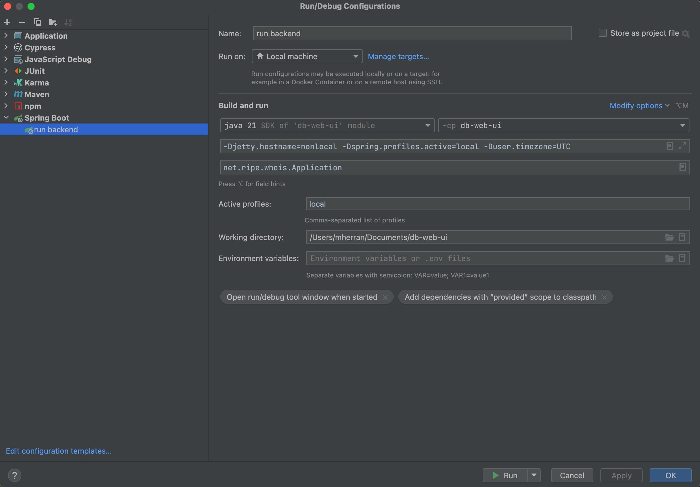

README for db-web-ui
====================

Links
-----
* [GitLab](https://gitlab.ripe.net/swe-database-team/db-web-ui)
* [Environments (Marvin)](https://marvin.ripe.net/display/db/DB+Environments)
* [Sonar](https://sonarqube.ripe.net/dashboard?id=db-web-ui)

Pre-requisites
-----------------
* maven (v3.0+)
* npm (v18.16.0)

Prepare application properties
------------------------------
* Copy `backend/src/main/resources/config/application.properties` to `backend/src/main/resources/config/application-local.properties` and modify it with your values if necessary.

Build on Local Machine
-----------------------

    mvn clean install

Start Full Development Server (Frontend + Backend) on Local Machine
-------------------------------------------------------------------

* first build (see above)

* map `127.0.0.1` to `localhost.ripe.net` in your local hosts file

* cd into the `backend` sub folder

* execute (using the Spring Boot Maven Plugin) execute: ```mvn spring-boot:run -Dspring-boot.run.profiles=local -Dspring.profiles.active=local -Dspring-boot.run.jvmArguments="-Duser.timezone=UTC"```. On the other hand, you can add a new configuration in Intellij.
  

* or Right click on ```/backend/src/main/java/net/ripe/whois/Application.java run in intellij, make sure to add -Dspring.profiles.active=local```

* access the app at: https://localhost.ripe.net:8443/db-web-ui/

Runtime
-------------------
Add the `-Dspring.profiles.active=<ENV>` to the JVM args of the application server.

Valid profile names are `local`, `dev`, `prepdev`, `rc` and `prod`.

Properties are read from the `/config/application-<ENV>`.properties file on the classpath.

To run locally add in the vm options: `-Dspring.profiles.active=local -Duser.timezone=UTC`

Frontend
--------
> Open a terminal and cd into the `frontend`

### Build

* `npm run build-dev`<br>
  webpack build Just-in-Time (JIT), used for local development. This build will include source-map - TypeScript code in browser for debugging.

* `npm run build`<br>
  webpack build Ahead-of-Time (AOT), which compiles app at build time, used for deployments.

* `npm run start`<br>
  Use this along with ```mvn spring-boot:run```. It watches the TypeScript and HTML files for changes and redeploys them
  when they've changed. In detail: the watch task is triggered by changes in the file system. Access application on https://localhost.ripe.net:4200/db-web-ui/ (port changes after logging, so pay attention to return it to 4200)

### Test

* `npm run test`<br>
  Running Karma unit tests locally for Angular 6+ with coverage. If you want to run the test one by one using Intellij you need to install a plugin called "karma"
    - Angular Unit test coverage is available locally `reports/unittest-coverage/index.html`

* `npm run test-remote`<br>
  Running Karma unit tests remotely in selenium chrome on `193.0.2.222:4444/wd/hub` for Angular 6+ with coverage

* `npm run start-mock`<br>
  Starts a server with the same configuration as the E2E tests, except the tests are not run. Use this configuration
  when you want to see the page as Cypress sees them - useful for fault finding and setting up mocks. <br />
  To be able to run e2e-no-test locally (http://localhost:9002/db-web-ui) with logged in user you will have to check <br />
  `hostname -s` and then resulted host name (for example laptop-123456.local) add<br />
  `127.0.0.1       laptop-123456.local` in your host file<br />
  `sudo vi /etc/hosts`

* run test using cypress
    * `npm run start-mock`
    * `npm run cypress:open`<br>
      This will open cypress, there you could specify the browser and the e2e test that you want to run.

### Record Mocks e2e tests

* `npm run start-mock`
* You should be able to open https://localhost.ripe.net:9002/db-web-ui/query and perform some requests.
* This mock will be automatically add into e2e/mocks/e2eTest folder <br>
  
* `npm run cypress:open` to run it locally

### Updating NPM and NPM packages

We use the most recent LTS version for db-web-ui. You can see which version this is by looking on the
[Node.js download page](https://nodejs.org/en/download/) or by using [`nvm`](https://github.com/nvm-sh/nvm), a tool for
managing local Node installations.

    nvm install --lts
    nvm use --lts

We use semver ranges so that bugfix versions of packages can be easily updated. To see what will be updated:

    npm outdated          # prints a list of non-current packages and their version state
    npm update --dry-run  # shows what `npm update` would do
    npm update            # bring packages up-to-date

To see which packages were updated, optionally against a branch name, use:

    npx diff-package-lock <branchname>

See the [diff-package-lock homepage](https://github.com/adiktofsugar/diff-package-lock) for more information

### Linting
* `npm run lint`<br>
  Lint rules can be found under `frontend/.eslintrc.json`

IntelliJ Preferences
--------------------
* Editor
    * File Types
        * Ignore Files and Folders
            * node_modules
            * dist
    * Code Style
        * Use single class import (do not allow .* asterisk imports)

* Project Structure
    * Project Settings
      * Project
        * Project SDK: 11
        * Language level: 11

* Plugins
    * Install Prettier plugin

* Languages & Frameworks
    * TypeScript
        * TypeScript language service
        * TSLint
            * Automatic TSLint configuration
    * JavaScript
        * Prettier
            * Prettier package: ~/projects/db-web-ui/frontend/node_modules/prettier
            * Check On 'Reformat Code' action

Architecture
------------

Rules of thumb:

* All rest calls from angular ui go via java-proxy. Java proxy transparently forwards to backends.
* In the new angular CRUD-ui (searching, creating, modifying and deleting whois objects) we stick to the "whoisresources-objects-object"-protocol.
  So when searching for maintainers of sso-user, we return a regular search result. What todo with the star?
  For the service that delivers info for the upper-right-sso-info, we use a dedicated protocol.
* When designing new urls for the java-proxy, stick to the whois conventions
* UI should be as simple as possible: So fetching or pushing information should be done with a single call. The java proxy can aggregate to achieve this.
* Always try to solve problem in backend. if not possible in java-proxy, as last resort in angular UI. We could promote functions from java-proxy to backend over time, so others can also profit.
* All services a provided by the java-proxy shall be protected by sso. If not logged in, a 403 shall be returned. The angular UI shall redirect to access.ripe.net on a REST 403

Responsibilities of java-proxy: Non-functionals only

* Security
* Aggregation
* Same origin
* Api-key to backends
* Caching
* Flexibilty: fix whois problems temporarily


Things every db-web-ui developer should know
--------------------------------------------

* Must read: https://blog.angularindepth.com/the-best-way-to-unsubscribe-rxjs-observable-in-the-angular-applications-d8f9aa42f6a0
* Style guide: https://angular.io/guide/styleguide
* Native Angular component used in this project: https://ng-bootstrap.github.io/#/getting-started
* Tend to transfer all bootstrap components to material design https://material.angular.io/
* RxJS operators with clear explanations and executable examples: https://www.learnrxjs.io/
* Use the Mozilla Developer Network (MDN) for JS specs — NOT W3Schools


HOWTOs
------
### Ripe web components
Join technical design bot channel on Mattermost to stay up to date with releases and change version in package.json file
https://gitlab.ripe.net/technical-design/ripe-app-webcomponents

### Update angular
Use https://update.angular.io

Matomo
------------------
Matomo is our self-hosted web analytics service. We use aggregated statistics to improve the user interface.

https://matomo.ripe.net/

User Interface Guidelines
-------------------------

The Technical Design circle has published a storybook of user interface elements that we should use as a style guide:
https://storybook.ripe.net

Cookie Compliance Project
-------------------------
If you add or remove a cookie to the application, please notify legal-request@ripe.net.

Do not store personal information in local storage.

Deployment
----------
Generally, we only deploy changes to production from the master branch, from a tag on a specific commit.

The team will review changes on a branch beforehand using a Merge Request, and changes are only merged once all issues are resolved.

Every so often an exception can be made and we deploy from a tag on a branch in these cases:
* Point releases when we select (cherry-pick) fixes (and nothing else) from master to a branch
* Hotfix release to fix a critical production issue


